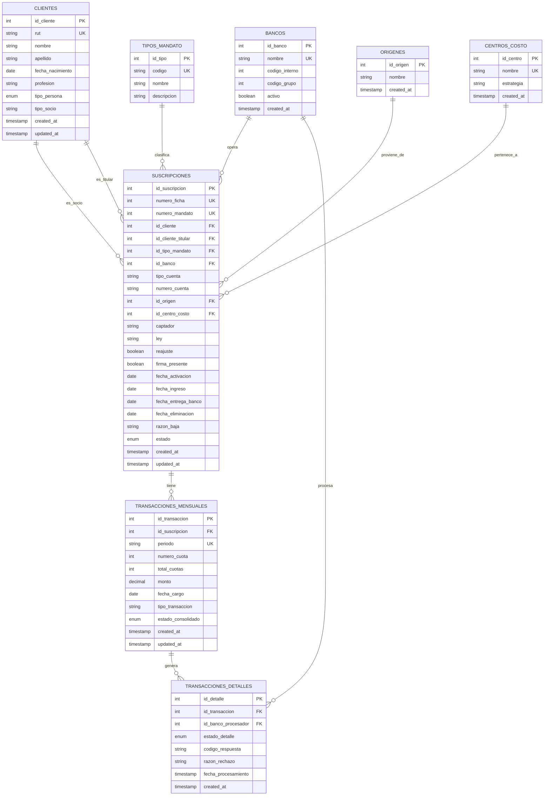

# Diagrama Entidad-Relación (ER) - CRM Suscripciones

## 📊 Modelo Relacional Completo



---

## 🔑 Relaciones Principales

### 1️⃣ Clientes → Suscripciones (1:N)
Un cliente puede tener múltiples mandatos activos y/o históricos.

```
CLIENTE (RUT: 7.138.947-2)
  ├─ SUSCRIPCIÓN 1 (Mandato #30449, PAC, Banco Estado)
  ├─ SUSCRIPCIÓN 2 (Mandato #29999, PAC, Banco Estado)
  └─ SUSCRIPCIÓN 3 (Mandato #26260, PAS, BBVA) [ELIMINADA]
```

**Casos especiales:**
- Socio ≠ Titular de cuenta (campos separados)
- Socio: quien recibe el servicio
- Titular: quien autoriza el débito

### 2️⃣ Suscripciones → Transacciones (1:N)
Cada mandato genera múltiples transacciones mensuales.

```
SUSCRIPCIÓN #30449 (PAC, Banco Estado)
  ├─ Período 2026-01: 1 cargo = $50,000
  ├─ Período 2026-02: 1 cargo + 1 reintento = $50,000
  ├─ Período 2026-03: 1 cargo = $50,000
  └─ Período 2026-08: 1 cargo = $50,000
```

### 3️⃣ Transacciones → Detalles (1:N)
Cada transacción puede tener múltiples intentos de procesamiento.

```
TRANSACCIÓN #2026-08 (Mandato #30449)
  ├─ INTENTO 1: RECHAZADA (Fondos insuficientes)
  │  └─ Banco: Banco Estado, Código: 05, Fecha: 31-08-2026
  ├─ INTENTO 2 (REINTENTO): ACEPTADA
  │  └─ Banco: Banco Estado, Código: 00, Fecha: 01-09-2026
  └─ Consolidado: ACEPTADA
```

---

## 💾 Cardinalidad de Datos

### Volumen Esperado (Agosto 2026)

```
┌────────────────────────────────┬──────────┬─────────────┐
│ Tabla                          │ Registros│ Crecimiento │
├────────────────────────────────┼──────────┼─────────────┤
│ clientes                       │   6,500  │ +100/mes    │
│ suscripciones (vigentes)       │   5,644  │ +200/mes    │
│ suscripciones (eliminadas hist)│   684    │ +30/mes     │
│ tipos_mandato                  │     10   │ Estático    │
│ bancos                         │     24   │ Estático    │
│ origenes                       │     20   │ +2/año      │
│ centros_costo                  │     10   │ Estático    │
├────────────────────────────────┼──────────┼─────────────┤
│ transacciones_mensuales (histórico total) | ~150,000 registros desde 2021 |
│ transacciones_detalles (reintento/fallo) | ~30,000 registros            |
└────────────────────────────────┴──────────┴─────────────┘
```

### Distribución de Datos por Período

```
PERÍODO                 CARGOS ACEPTADOS  CARGOS RECHAZADOS  TOTAL
────────────────────────────────────────────────────────────────
2026-08 (Agosto)        5,645            2,180              7,825
2026-07 (Julio)         5,700            2,150              7,850
2026-06 (Junio)         5,680            2,140              7,820
2026-05 (Mayo)          5,650            2,100              7,750
...
2021-01 (Enero 2021)    4,200            1,800              6,000
────────────────────────────────────────────────────────────────
TOTAL HISTÓRICO         ~150,000         ~30,000           ~180,000
```

---

## 📋 Descripciones de Tablas

### **CLIENTES**
Información consolidada de socios (donantes) y titulares de cuenta.

| Campo | Tipo | Descripción |
|-------|------|-------------|
| id_cliente | INT | Identificador único |
| rut | VARCHAR(15) | Código único, ej: "7.138.947-2" |
| nombre | VARCHAR(100) | Nombre de pila |
| apellido | VARCHAR(100) | Apellido paterno y materno |
| fecha_nacimiento | DATE | DOB para verificaciones |
| profesion | VARCHAR(100) | Ocupación laboral |
| tipo_persona | ENUM | 'Natural' o 'Jurídica' |
| tipo_socio | VARCHAR(50) | "SOCIO", "SOCIO 2023", etc. |

**Índices:**
- `uk_rut`: Búsqueda por RUT (deduplicación)
- `idx_nombre_apellido`: Búsqueda por nombre

---

### **SUSCRIPCIONES**
Tabla central que integra todo sobre un mandato, tanto vigente como histórico.

| Campo | Tipo | Descripción |
|-------|------|-------------|
| id_suscripcion | INT | PK |
| numero_ficha | INT | ID único de la suscripción (de DUES) |
| numero_mandato | INT | ID único del mandato |
| id_cliente | INT | FK a socio (donante) |
| id_cliente_titular | INT | FK a titular de cuenta (puede diferir) |
| id_tipo_mandato | INT | FK a PAC/PAS/DEC |
| id_banco | INT | FK a banco/tarjeta operadora |
| tipo_cuenta | VARCHAR | "Checking", "Savings", "Credit Card" |
| numero_cuenta | VARCHAR | Cuenta enmascarada si es sensible |
| id_origen | INT | Cómo se captó (SOCIOS 2025, REFERRAL, etc.) |
| id_centro_costo | INT | Centro operativo (TECHO OC, REG, etc.) |
| captador | VARCHAR | Persona que capturó el mandato |
| ley | VARCHAR | Aplicable (Sin Ley, Ley 19.251, etc.) |
| reajuste | BOOLEAN | ¿Se aplica IPC? |
| firma_presente | BOOLEAN | ¿Hay firma física? |
| fecha_activacion | DATE | Cuando inicia débito automático |
| fecha_ingreso | DATE | Cuando ingresa al sistema |
| fecha_entrega_banco | DATE | Cuando se envía al banco |
| fecha_eliminacion | DATE | Si status = ELIMINADA |
| razon_baja | VARCHAR | Motivo de cancelación |
| estado | ENUM | VIGENTE / ELIMINADA / SUSPENDIDA |

**Índices críticos:**
- `uk_numero_ficha`: Evita duplicados
- `idx_estado`: Filtrar vigentes vs eliminadas rápido
- `idx_cliente`: Encontrar todos los mandatos de un cliente
- `idx_banco`: Análisis por institución

---

### **TRANSACCIONES_MENSUALES**
Cada mes = 1 registro por mandato (si hay cargo).

| Campo | Tipo | Descripción |
|-------|------|-------------|
| id_transaccion | INT | PK |
| id_suscripcion | INT | FK al mandato |
| periodo | VARCHAR(7) | "2026-08" (YYYY-MM) |
| numero_cuota | INT | Cuota #N del mandato |
| total_cuotas | INT | Total de cuotas esperadas |
| monto | DECIMAL | Cantidad a cobrar |
| fecha_cargo | DATE | Día que se intentó el cobro |
| tipo_transaccion | VARCHAR | "Cargo", "Reintento", "Vencimiento" |
| estado_consolidado | ENUM | ACEPTADA / RECHAZADA / PARCIAL |

**Unique Constraint:**
- `(id_suscripcion, periodo)`: No hay duplicados por mandato/mes

---

### **TRANSACCIONES_DETALLES**
Registra cada intento real contra el banco (puede haber reintentos).

| Campo | Tipo | Descripción |
|-------|------|-------------|
| id_detalle | INT | PK |
| id_transaccion | INT | FK a transacción mensual |
| id_banco_procesador | INT | Banco que procesó (puede diferir) |
| estado_detalle | ENUM | ACEPTADA / RECHAZADA / PENDIENTE |
| codigo_respuesta | VARCHAR | Código retornado por banco (ej: "00" = OK) |
| razon_rechazo | VARCHAR | "Fondos insuficientes", "Tarjeta vencida" |
| fecha_procesamiento | TIMESTAMP | Cuándo respondió el banco |

**Patrón:**
```
1 TRANSACCIÓN_MENSUAL (período 2026-08) →
  └─ N TRANSACCIONES_DETALLES (intento 1, intento 2, etc.)
```

---

### **BANCOS**
Catálogo de instituciones operadoras de débito.

| Campo | Tipo | Descripción |
|-------|------|-------------|
| id_banco | INT | PK |
| nombre | VARCHAR | "Banco Estado", "BCI", "Visa", etc. |
| codigo_interno | INT | Código interno TCH |
| codigo_grupo | INT | 1=Bancos, 2=Tarjetas de crédito |
| activo | BOOLEAN | ¿Acepta nuevos mandatos? |

**Ejemplos:**
```
1. Chile-Edwards-CitI-CrediChile
2. Banco Estado
3. BBVA
...
20. Visa (Tarjeta)
21. Mastercard (Tarjeta)
```

---

### **TIPOS_MANDATO**
Tipos de mandato SEPA-equivalentes.

| Campo | Tipo | Descripción |
|-------|------|-------------|
| id_tipo | INT | PK |
| codigo | VARCHAR | "PAC", "PAS", "DEC" |
| nombre | VARCHAR | "Débito Automático", "Pago Automático", etc. |

**Valores:**
- **PAC**: Pago Automático en Cuenta (cuenta corriente)
- **PAS**: Pago Automático en Tarjeta (débito/crédito)
- **DEC**: Débito Electrónico en Cuenta

---

### **ORIGENES**
Canales de captación.

| Campo | Tipo | Descripción |
|-------|------|-------------|
| id_origen | INT | PK |
| nombre | VARCHAR | Ej: "SOCIOS 2025", "SOCIOS 2023", "REFERRAL" |

---

### **CENTROS_COSTO**
Centros operativos (para reportes).

| Campo | Tipo | Descripción |
|-------|------|-------------|
| id_centro | INT | PK |
| nombre | VARCHAR | "TECHO OC" (Oficina Central), "REG" (Regional), etc. |
| estrategia | VARCHAR | Estrategia asociada (si aplica) |

---

## 🔍 Queries Útiles por Caso de Uso

### 1. **"Dame todos los mandatos vigentes de Banco Estado"**
```sql
SELECT s.numero_ficha, s.numero_mandato, c.nombre, c.rut, b.nombre as banco
FROM suscripciones s
JOIN clientes c ON s.id_cliente = c.id_cliente
JOIN bancos b ON s.id_banco = b.id_banco
WHERE s.estado = 'VIGENTE' 
  AND b.nombre = 'Banco Estado'
ORDER BY s.fecha_activacion DESC;
```

### 2. **"Tasa de aceptación por banco (últimos 3 meses)"**
```sql
SELECT 
    b.nombre as banco,
    COUNT(DISTINCT tm.id_transaccion) as total_cargos,
    SUM(CASE WHEN tm.estado_consolidado = 'ACEPTADA' THEN 1 ELSE 0 END) as aceptados,
    ROUND(100.0 * SUM(CASE WHEN tm.estado_consolidado = 'ACEPTADA' THEN 1 ELSE 0 END) 
        / COUNT(DISTINCT tm.id_transaccion), 2) as tasa_aceptacion
FROM transacciones_mensuales tm
JOIN suscripciones s ON tm.id_suscripcion = s.id_suscripcion
JOIN bancos b ON s.id_banco = b.id_banco
WHERE tm.periodo >= DATE_FORMAT(DATE_SUB(NOW(), INTERVAL 3 MONTH), '%Y-%m')
GROUP BY b.id_banco, b.nombre
ORDER BY tasa_aceptacion ASC;
```

### 3. **"Clientes con tarjetas vencidas (para reintentos)"**
```sql
SELECT DISTINCT 
    c.id_cliente, c.nombre, c.apellido, c.rut,
    GROUP_CONCAT(s.numero_mandato) as mandatos,
    MAX(tm.fecha_cargo) as ultimo_intento
FROM clientes c
JOIN suscripciones s ON c.id_cliente = s.id_cliente
JOIN transacciones_mensuales tm ON s.id_suscripcion = tm.id_suscripcion
JOIN transacciones_detalles td ON tm.id_transaccion = td.id_transaccion
WHERE td.razon_rechazo LIKE '%venc%' 
  AND tm.periodo = DATE_FORMAT(NOW(), '%Y-%m')
  AND td.estado_detalle = 'RECHAZADA'
GROUP BY c.id_cliente
ORDER BY ultimo_intento DESC;
```

### 4. **"Ingreso mensual por origen de captación"**
```sql
SELECT 
    o.nombre as origen,
    tm.periodo,
    COUNT(DISTINCT s.id_suscripcion) as mandatos_activos,
    SUM(CASE WHEN tm.estado_consolidado = 'ACEPTADA' THEN tm.monto ELSE 0 END) as recaudacion
FROM suscripciones s
JOIN origenes o ON s.id_origen = o.id_origen
JOIN transacciones_mensuales tm ON s.id_suscripcion = tm.id_suscripcion
WHERE s.estado = 'VIGENTE'
GROUP BY o.id_origen, tm.periodo
ORDER BY tm.periodo DESC, recaudacion DESC;
```

---

## 🎯 Notas de Implementación

1. **Desnormalización controlada:**
   - Algunos campos de `clientes` se replican en `suscripciones` para performance (RUT, Nombre)
   - Esto acelera queries sin FKs constantes

2. **Auditoria:**
   - `created_at` y `updated_at` en tablas transaccionales
   - Tabla separada `datos_auditoria` para tracking de imports

3. **Particionamiento (futuro):**
   - `transacciones_mensuales` por `periodo` (RANGE)
   - `transacciones_detalles` por `fecha_procesamiento` (RANGE)
   - Mejora performance en histórico de 150K+ registros

4. **Backups:**
   - Backup diario de la BD
   - Especial atención a `suscripciones` (datos maestros críticos)

---

**Versión:** 1.0  
**Actualizado:** 2026-09-12  
**Autor:** Esteban (Proyecto Título)
