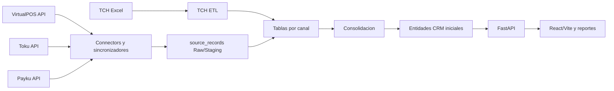

# System Overview

## Arquitectura actual

Los canales API ingresan mediante conectores de backend; TCH ingresa desde reportes Excel. Los datos saneados se preservan en staging, pasan por tablas por canal y se consolidan para su consulta desde FastAPI y React/Vite.

PostgreSQL es la fuente central de verdad. Los proveedores no escriben directamente en Core; la API intermedia las operaciones autorizadas. La identidad transversal unica entre plataformas sigue pendiente de implementacion tecnica.

## Referencias tecnicas

- [Vision de arquitectura](../../docs/architecture/overview.md)
- [Flujo de datos](../../docs/architecture/data-flow.md)
- [Base de datos](../../docs/architecture/database.md)
- [Integraciones](../../docs/architecture/integrations.md)
- [Seguridad](../../docs/architecture/security.md)
